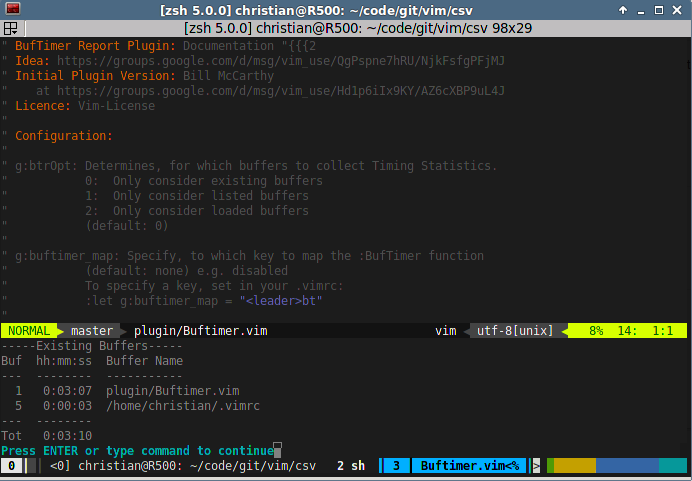

BufTimer
========

> Time your editing duration

This small plugin uses Vims `reltime` feature, to measure how long you spend editing your files.

This means, it defines a couple of autocommands to start and stop a timer per buffer. You can see the timing statistics by using `:BufTimer` for the current buffer or `:BufTimerReport` for all buffers (what all buffers mean, depends on the configuration variable `g:btrOpt` variable).

This plugin is based on Bill McCarthys [BufTimer][1] plugin which itself is based on a [discussion][2] on the [vim mailinglist][3], but has been further rewritten.

[1]: https://groups.google.com/d/msg/vim_use/Hd1p6iIx9KY/AZ6cXBP9uL4J
[2]: https://groups.google.com/d/msg/vim_use/QgPspne7hRU/NjkFsfgPFjMJ
[3]: https://groups.google.com/group/vim_use

Configuration
-------------

There are only some configuration items, to further refine the behaviour of this plugin.

* `g:btrOpt`
This variable determines, which buffers it will consider when outputting the `:BufTimerReport` statistics. Values:
  0. *0*  consider all existing buffers,
  1. *1* consider only listed buffers,
  2. *2* consider only loaded buffers.
  (default value: 0)
* `g:buftimer_map`
This Variable can be set to a keys combination to trigger the output of the `:BufTimer` report. To specify a key mapping, simply put into your .vimrc:

        :let g:buftimer_map = "<leader>bt"

(default value: not set)
* `g:buftimer_report_map`
This Variable can be set to a keys combination to trigger the output of the `:BufTimer` report. To specify a key mapping, simply put into your .vimrc:

        :let g:buftimer_report_map = "<leader>br"

(default value: not set)
* `g:buf_report_autosave_periodic`
This Variable can be set in order to periodicly (in seconds) save report to a file. Simply put into your .vimrc:

        :let g:buf_report_autosave_periodic = 1000

(default : disabled)

* `g:buf_report_autosave_dir`
This Variable can be set in order to specify which directory report file will written to

        :let g:buf_report_autosave_dir = "/tmp"

(default : /tmp)

Commands
--------

* `:BufTimer` Report the time spent in the current buffer
* `:BufTimerReport` Print a report about the time spent in all buffers.
* `:BufTimerReport filename` Print a report to file when Vim quits

Installation
---

Use the plugin manager of your choice. Or download the [Vimball][] version of the plugin, edit it with Vim and simply source it (`:so %`).

[Vimball]: https://raw.github.com/chrisbra/BufTimer/master/BufTimer.vmb

License & Copyright
-------

Based on work by Bill McCarthy. Further developed by Christian Brabandt.
The Vim License applies. See `:h license`

© 2013 by Christian Brabandt

__NO WARRANTY, EXPRESS OR IMPLIED.  USE AT-YOUR-OWN-RISK__
